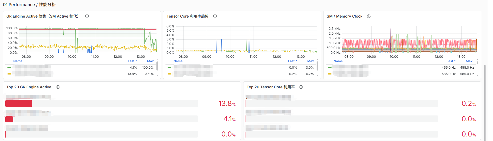
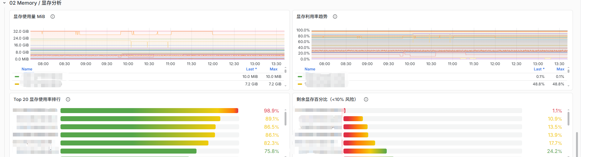
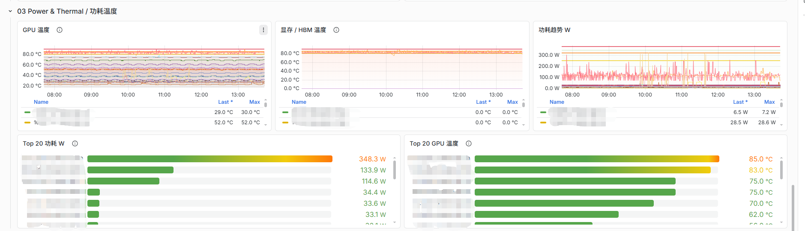
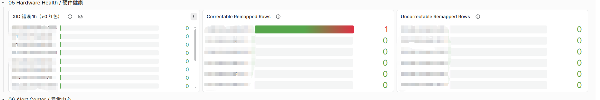

# DCGM GPU Cluster Dashboard

English | [简体中文](README.md)

---

# 🚀 Overview

A production-ready Grafana dashboard for NVIDIA GPU clusters built on:

* NVIDIA DCGM Exporter
* Prometheus
* Grafana

Designed for:

* LLM Training
* LLM Inference
* Kubernetes GPU Clusters
* Slurm Clusters
* HPC Workloads

---

# 📸 Screenshots

## Cluster Overview

## GPU Inventory

## Performance Analysis

## Memory Analysis

## Power & Thermal

## Hardware Health

## Alert Center

---

# ✨ Features

## Cluster Overview

Provides:

* Average GPU Utilization
* Average Memory Utilization
* Average Temperature
* Average Power Consumption
* Active GPU Count
* High Temperature GPU Count
* High Memory Usage GPU Count
* XID Error GPU Count

---

## GPU Inventory

Displays:

* Instance
* Hostname
* GPU Index
* UUID
* GPU Model
* Driver Version
* PCI Bus ID

Plus:

* GPU Utilization
* Memory Utilization
* Tensor Utilization
* Power Usage
* Temperature

---

## Performance Analysis

Includes:

* GPU Utilization Trend
* Tensor Core Utilization
* GR Engine Activity
* Top GPU Ranking
* Top Tensor Ranking

Suitable for:

* PyTorch
* TensorFlow
* DeepSpeed
* Megatron-LM
* vLLM
* TensorRT

---

## Memory Analysis

Memory utilization is calculated from:

FB_USED / (FB_USED + FB_FREE)

No dependency on:

* DCGM_FI_DEV_FB_TOTAL

which improves compatibility across GPU generations.

---

## Power & Thermal

Temperature thresholds:

| Temperature | Status    |
| ----------- | --------- |
| <80°C       | Normal    |
| ≥80°C       | Warning   |
| ≥85°C       | High Risk |
| ≥90°C       | Critical  |

---

## Hardware Health

Supports:

* XID Monitoring
* ECC Monitoring
* Remapped Rows Monitoring
* PCIe Error Analysis

---

## Alert Center

Focuses on actionable events:

* High Temperature GPUs
* High Memory Usage GPUs
* XID Errors
* Risk Ranking
* Historical Alerts

---

# 🎯 Advantages

### Cluster-Oriented Design

Built for:

* GPU Clusters
* Kubernetes GPU Pools
* Slurm Clusters
* AI Infrastructure

---

### High Compatibility

Supports:

* DCGM 4.x
* Grafana 11+
* Grafana 12+
* Grafana 13+
* Prometheus 2.x+

---

### Operations Friendly

Quickly answers:

* Which GPUs are busy?
* Which GPUs are idle?
* Which GPUs are close to OOM?
* Which GPUs are overheating?
* Which GPUs have XID errors?
* Which GPUs need attention first?

---

# 🛠 Requirements

Recommended:

* nvidia/dcgm:4.5.2-1-ubuntu22.04
* grafana/grafana:13.x
* prometheus:2.x

---

# 📦 Installation

1. Deploy DCGM Exporter
2. Configure Prometheus Scraping
3. Import Dashboard JSON
4. Select Prometheus Datasource

Start monitoring your GPU cluster.

---

# 📄 License

Apache-2.0 License

