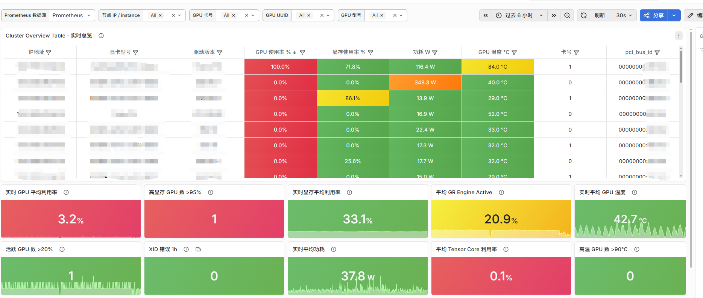
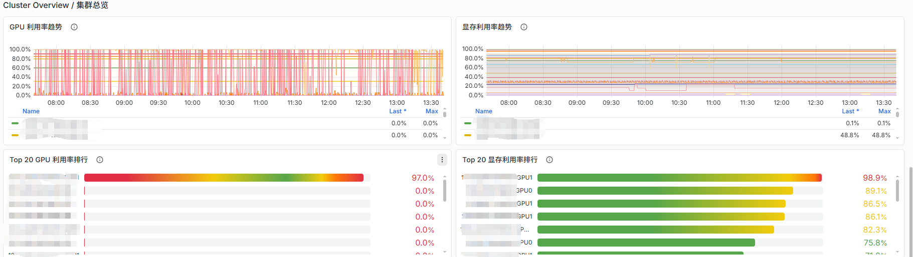
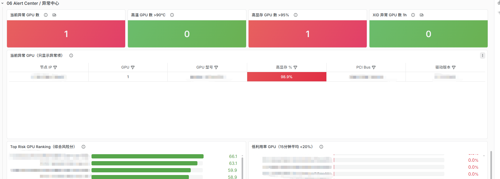

# DCGM GPU Cluster Dashboard

[English](README.en.md) | 简体中文

基于 **DCGM Exporter + Prometheus + Grafana** 的 NVIDIA GPU 集群监控仪表盘。

适用于：

* AI 训练集群
* 大模型训练
* 大模型推理
* Kubernetes GPU 集群
* Slurm GPU 集群
* HPC 集群

---

## 仪表盘预览

### 集群总览



### GPU 实时总览



### 异常中心



---

## 功能特性

| 集群总览    | 性能分析             | 健康监控          |
| ------- | ---------------- | ------------- |
| GPU 利用率 | Tensor Core 利用率  | XID 错误        |
| 显存利用率   | GR Engine Active | ECC 监控        |
| GPU 温度  | GPU 排行榜          | Remapped Rows |
| GPU 功耗  | Tensor 排行榜       | 异常时间线         |

| 异常中心   | 数据分析          | 资产管理       |
| ------ | ------------- | ---------- |
| 异常 GPU | 显存分析          | GPU UUID   |
| 风险排行   | 温度分析          | GPU 型号     |
| 热点 GPU | PCIe / NVLink | 驱动版本       |
| OOM 检测 | 功耗分析          | PCI Bus ID |

---

## 核心亮点

* 🚀 GPU 集群总览
* 📊 GPU / 显存 / Tensor 监控
* 🔥 功耗与温度分析
* ❤️ GPU 健康监控
* ⚠️ 智能异常中心
* 🏆 GPU 风险排行
* 🔍 GPU 资产管理
* 🌐 多节点集群支持

---

## 兼容性

| 组件         | 版本   |
| ---------- | ---- |
| DCGM       | 4.x  |
| Prometheus | 2.x+ |
| Grafana    | 11+  |

推荐版本：

```yaml
nvidia/dcgm:4.5.2-1-ubuntu22.04
grafana/grafana:13.x
```

---

## 安装说明

1. 部署 DCGM Exporter
2. 配置 Prometheus 抓取
3. 导入 Dashboard JSON
4. 选择 Prometheus 数据源

Dashboard 文件：

```text
dashboards/dcgm_gpu_cluster_dashboard.json
```

---

## 开源协议

Apache-2.0 License

